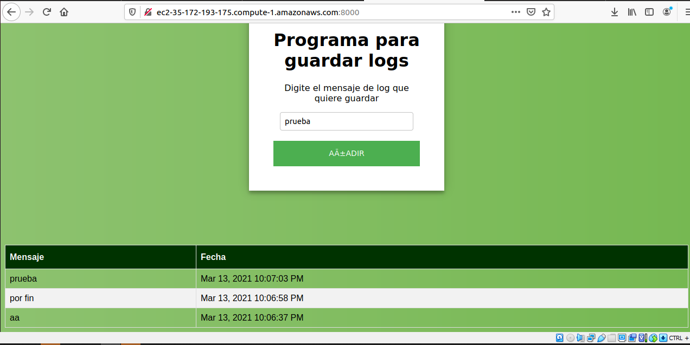
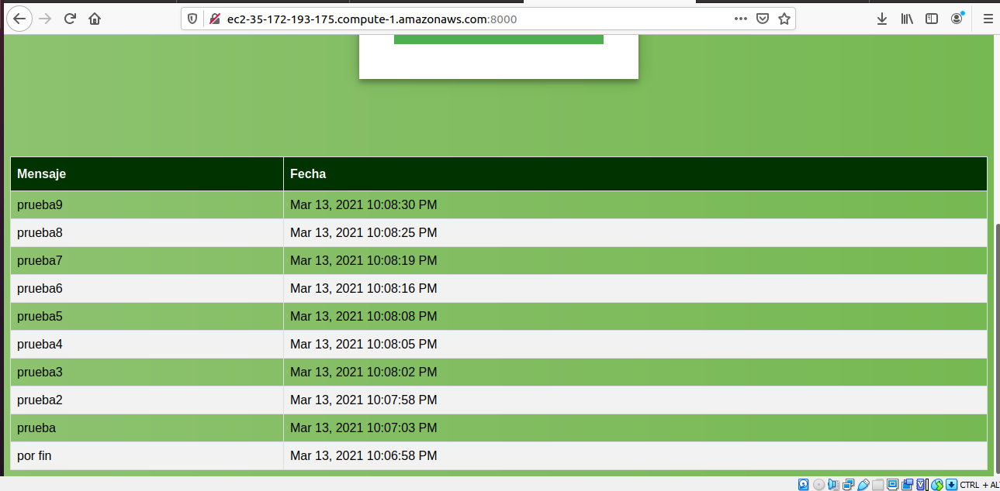
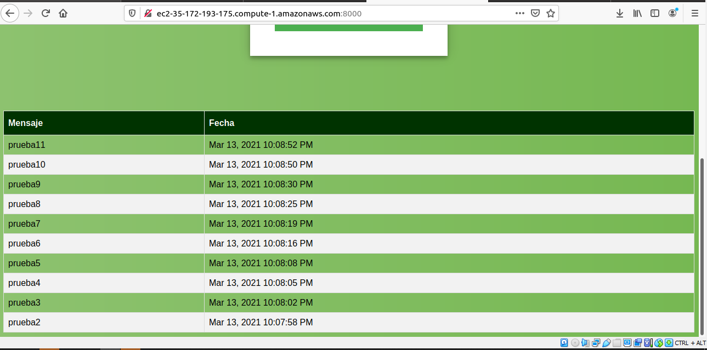

# Proyecto realizado por Johann Steven Bogotá
# Laboratorio 05 AREP

En este taller se construira una aplicación con la siguiente arquitectura propuesta que se desplegara en aws  usando EC2 y Docker


En la imagen anterior se tiene que 
- El servicio MongoDB es una instancia de MongoDB corriendo en un container de docker en una máquina virtual de EC2
- LogService es un servicio REST que recibe una cadena, la almacena en la base de datos y responde en un objeto JSON con las 10 ultimas cadenas almacenadas en la base de datos y la fecha en que fueron almacenadas.
- La aplicación web APP-LB-RoundRobin está compuesta por un cliente web y al menos un servicio REST. El cliente web tiene un campo y un botón y cada vez que el usuario envía un mensaje, este se lo envía al servicio REST y actualiza la pantalla con la información que este le regresa en formato JSON. El servicio REST recibe la cadena e implementa un algoritmo de balanceo de cargas de Round Robin, delegando el procesamiento del mensaje y el retorno de la respuesta a cada una de las tres instancias del servicio LogService.

### Prerequisites

* [Docker](https://www.docker.com/) - Container Manager
* [Maven](https://maven.apache.org/) - Dependency Management
* [Java 8](https://www.oracle.com/co/java/technologies/javase/javase-jdk8-downloads.html) -  Development Environment 
* [Git](https://git-scm.com/) - Version Control System
* [Spark](http://sparkjava.com/) - Micro framework for creating web applications in Java 8

## Compilar programa
- Clonar el repositorio
```
git clone https://github.com/johann9911/AREP-LAB5.git
``` 
- Para compilar (Se tienen dos proyectos por separado, para ejecutar los pasos de maven, ir a las carpetas donde se encuentra el POM)
```
mvn clean install
```
- Para generar la documentación
```
mvn javadoc:javadoc o mvn javadoc:jar (generar jar)
```
- Para usar la aplicación desplegada en AWS ir al siguiente enlace
```
http://ec2-35-172-193-175.compute-1.amazonaws.com:8000/
```

## Test de ejecución
Insertar un log

Obtener un log ingresado

Obtener los 10 ultimos logs

## Documentación

Mirar RoundRobin [Documentacion](https://github.com/johann9911/AREP-LAB5.git/apidocs_r/)

Mirar ServicesLog [Documentacion](https://github.com/johann9911/AREP-LAB5.git/apidocs_s/)

## Licencia
Ver licencia en LICENCE.txt para más detalles.